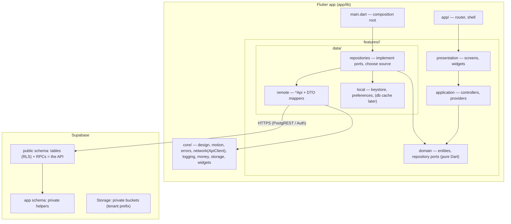

# Module architecture

Vepari is a **modular monolith**: one Flutter app and one Postgres-backed
backend, each built from small modules with explicit contracts. Boundaries
are drawn where real boundaries exist — the network sits only between the app
and the database API; inside the app, modules call each other directly
through public contracts.

## Layers inside a feature
| Layer | Owns | May depend on | Must not |
|---|---|---|---|
| presentation | Widgets, screen state, user feedback | application, domain, core, l10n, other modules' barrels | import `data/`, Supabase |
| application | Controllers/providers, orchestration, use cases (only when real logic exists) | domain, core, other barrels | import `data/`, Supabase |
| domain | Entities, value objects, repository interfaces, pure rules | core value types (Money) | Flutter, Riverpod, Supabase, other layers |
| data/remote | `*Api` classes: one per backend area, DTO ↔ domain mapping | core/network, domain | business rules, UI |
| data/local | Device persistence (keystore, preferences, later SQLite cache) | domain | network |
| data/repositories | Implement domain ports; decide local vs remote vs cache | remote, local, domain | UI |

The composition root (`lib/main.dart`) is the only place that constructs
adapters (`*Api`, `*RepositoryImpl`, storage) and wires them into providers.
Tests replace them with fakes through the same providers.

## Public contract of a module
`lib/features/<x>/<x>.dart` exports only what other modules need (screens,
providers, domain types). `lib/features/<x>/<x>_adapters.dart` exports
concrete adapters for the composition root only. Everything else is internal.

## Enforced rules (`app/tool/check_boundaries.dart`, CI)
- **R1** core never imports features/app.
- **R2** cross-module imports only through the public barrel.
- **R3** domain is pure Dart.
- **R4** presentation/application never import `data/`.
- **R5** Supabase and `*_adapters.dart` only in data layers, `core/network`,
  `core/errors` and `main.dart`.

## Choosing the mechanism (brief add-on §34)
| Need | Mechanism | Example |
|---|---|---|
| Pure computation | Function / value object | `Money.times`, `Username.validate`, `parseLegalMarkdown` |
| Reusable business capability | Service / use case (only with real logic) | Order composition (next increment) |
| Device persistence | Repository → local data source | `SecureSessionStorage`, `SharedPreferencesStore` |
| Server data / authoritative rules | Repository → `*Api` → `ApiClient` → RPC | `DashboardApi`, `AuthApi` |
| Long-running / retryable work | Background job module | Planned, see below |
| Cross-feature | Public barrel contract | Home → `currentSessionProvider` |

## Background work (planned module `features/jobs`)
Needed when media upload and share-file cleanup arrive. Design:
`Service → persisted job (payload + idempotency key + attempts) → worker →
repository`. Workers never depend on a screen; jobs survive app restarts;
retries use backoff and only for idempotent steps; uploads are resumable and
finalised by an idempotent RPC. Built with the media increment, not before.

## Backend modules
| Area | Tables | API (RPCs) |
|---|---|---|
| Tenancy & access | tenants, app_users, tenant_members, member_permissions, business_profiles, tenant_counters | current_session, set_member_permissions, set_member_active, admin_* (service role) |
| Catalogue | categories, products, product_private, product_media | catalogue_page, share_product |
| Customers & rates | customers, customer_balances, customer_product_rates | regular_maal |
| Orders & money | orders, order_items, payments, ledger_entries, bills | create_order, record_payment, record_adjustment, transition_order, cancel_order, issue_bill, reorder_preview, bill_payload |
| Communication | remarks, photo_enquiries, share_assets, notifications | (table API with RLS) |
| Cross-cutting | audit_logs | search_all, dashboard_summary |
Private helpers live in schema `app` (not exposed by PostgREST).
