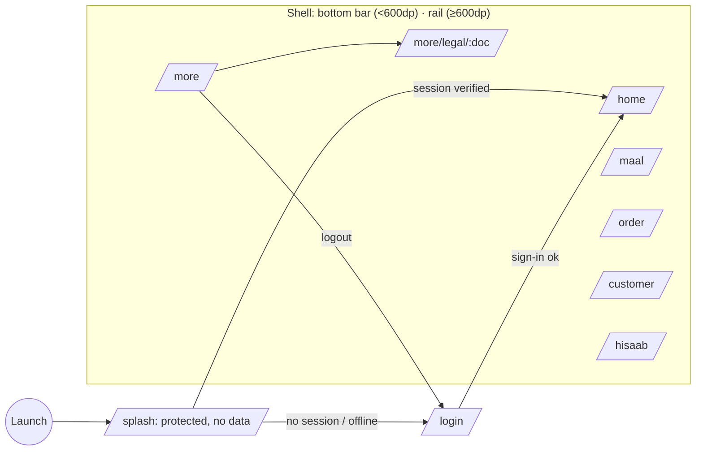

# Navigation

## Guards
`redirectFor(session, location)` in `app/lib/app/router.dart`:
- **Unknown** identity → `/splash` only. No business data is rendered.
- **Signed out** → `/login` for every route, deep links included.
- **Signed in** → `/splash` and `/login` redirect to `/home`; deep links are kept.

Malformed deep links (e.g. `/more/legal/unknown`) redirect to `/more`; they
never crash. Ids in future deep links (orders, customers) are re-authorised by
the server (RLS) when the screen loads — routes never trust ids.

## Back behaviour
1. Keyboard open → Back closes the keyboard (platform).
2. Sheet or dialog open → Back closes it.
3. Pushed route (e.g. legal) → pop.
4. Root of a non-Home tab → go to Home (`AppShell` `PopScope`).
5. Home root → leave the app.

Unsaved work uses `UnsavedChangesGuard`. Only screens holding real unsaved
input ask, and the dialog states the consequence.

## Tabs and state
`StatefulShellRoute.indexedStack` keeps each tab's stack alive. Re-tapping
the active tab returns it to its root.

## Contextual actions (not separate modules)
WhatsApp appears where content lives: product → share, customer → WhatsApp,
order → send, bill → send, Hisaab → send, payment → receipt.
