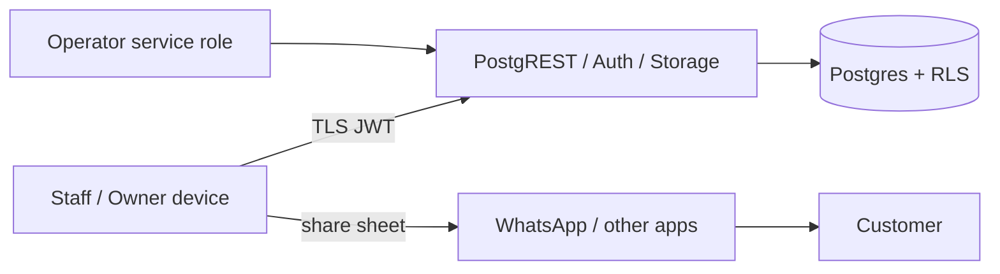

# Threat model (STRIDE)

**Scope:** Flutter app, Supabase (Postgres/PostgREST, Auth, Storage), and
WhatsApp sharing through the OS share sheet.

Trust boundaries:
- device ↔ Supabase
- tenant ↔ tenant (inside the database)
- app ↔ share target (data leaves our control)

| Threat | Example | Mitigation | Evidence |
|---|---|---|---|
| **S**poofing | Use another user's session | Supabase Auth, short-lived JWT plus refresh; session in the keystore; backups disabled | auth.md |
| S | Forge a tenant id | Tenant only from JWT plus membership; stamping trigger; no column grant | tenant_isolation_test |
| **T**ampering | Edit ledger, payments or order lines | No client write grants; immutability triggers; DEFINER RPCs only | orders_money_test "immutable" |
| T | Send own totals or rates | Server recomputes; `expected_rate` is only a guard | orders_money_test |
| T | Raise own permissions | Membership and permission writes are owner RPCs only; no grants | authorization_privacy_test "no permission escalation" |
| **R**epudiation | "I didn't change that rate" | Audit log for orders, payments, bills, rates, members and settings; immutable; owner-readable | authorization_privacy_test "audit" |
| **I**nformation disclosure | Cross-tenant read via ids, search or files | RLS, composite FKs, storage prefix policies; uniform not-found | tenant_isolation_test |
| I | Staff sees cost/supplier | Separate owner-only table | authorization_privacy_test |
| I | Share leaks internals | Allow-listed share RPCs; tests seed secrets and assert absence | authorization_privacy_test "safe share" |
| I | Previous user's data shown after switching account | Tenant-scoped cache cleared before the signed-out state; splash shows nothing | session_controller_test |
| I | Secrets in the app or logs | Only the publishable key ships; logger redacts sensitive keys; payloads never logged | api_client_test; gitleaks in CI |
| **D**enial of service | Huge orders or queries | Line and quantity caps; result limits clamped; indexed plans; Supabase rate limits on auth | orders_money_test; scale_perf_test |
| D | Double taps / retry storms | Single-flight buttons; idempotency keys plus advisory locks | app_button_test; idempotency tests |
| **E**levation of privilege | Call admin RPCs | EXECUTE granted to `service_role` only | authorization_privacy_test |
| E | Search-path hijack in DEFINER functions | `set search_path = ''`; schema-qualified names | Migrations |

## Residual risks (tracked in known-issues.md)
- Hosted-project settings (JWT expiry, auth rate limits, MFA) need to be
  configured and reviewed in Supabase.
- Upload malware scanning is not yet designed beyond type, size and magic-byte
  validation.
- WhatsApp content leaves our control once shared. Mitigated by allow-listing.
